Команды бота

Реализовано меню команд для удобства:

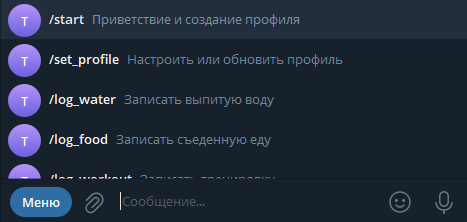

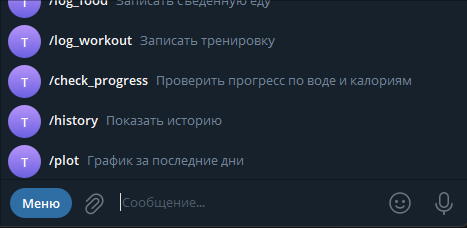

1. Настройка профиля

/set_profile
Запрашивает у пользователя:

- Пол (муж/жен)
- Вес (кг)
- Рост (см)
- Возраст
- Количество минут активности в день
- Город (для расчёта нормы воды с учётом температуры)

Добавлен ввод пола, так как калории зависят не только от роса и веса, но и от пола.

Пример диалога:

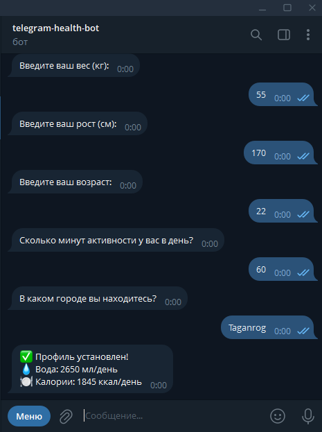

2. Логирование воды

/log_water 
- Бот спрашивает количество выпитой воды
Добавляет выпитую воду (мл) и показывает оставшуюся норму.

Здесь функция немного изменена, ради удобства, так как у нас есть меню в котором можно просто нажать на команду и потом уже просто написать кол-во мл, а не прописывать каждый раз команду.

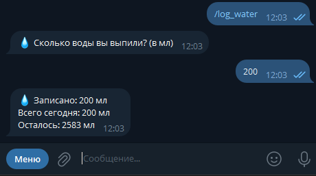

3. Логирование еды

/log_food 
- Бот спрашивает название продукта
- Получает калорийность через API (`food_api.search_food`)
- Пользователь вводит граммы продукта
- Бот сохраняет потребленные калории

Использовалось openfoodfacts, как по заданию, не смогла найти бесплатную русскую замену, а с переводами была проблема, на том же USDA API продукты в множественном числе + работает только с впн.
Н самом деле в один день API OpenFoofFacts долго отвечала, а в другой моментально, тут как повезет

Здесь пределано с той же логикой, у нас есть меню в котором можно просто нажать на команду и потом уже просто написать продукт, а не прописывать каждый раз команду.

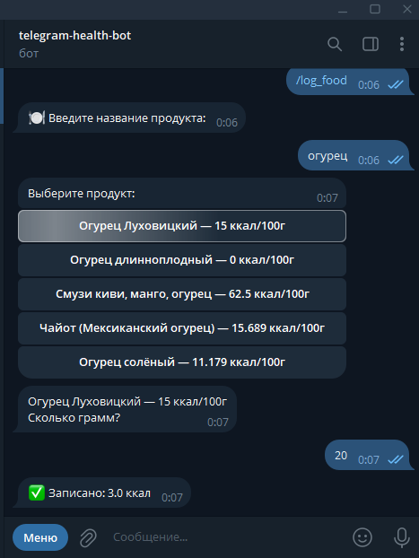

4. Логирование тренировок
/log_workout
- Вводим тип тренировки (бег, йога, плавание и т.д.)
- Вводим длительность в минутах
- Рассчитываются сожжённые калории и добавляется вода по активности

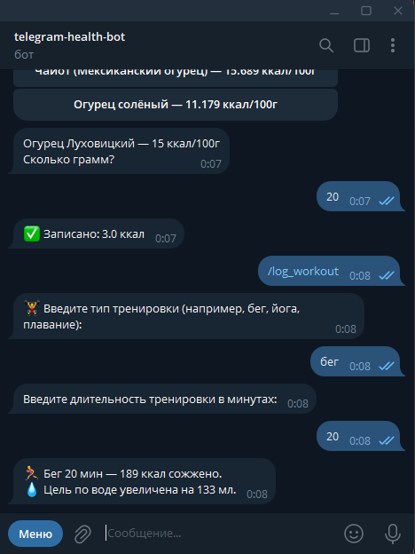

5. Проверка прогресса
/check_progress
Выводит текущие показатели воды и калорий:

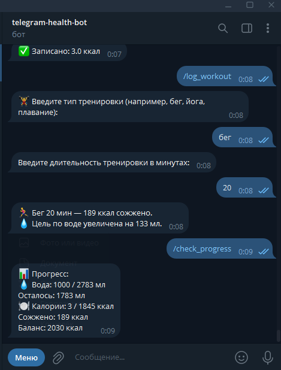

6. История
/history
- Сохраняется история за каждый день  
- Доступны данные: вода, калории, сожжённые калории

Тут есть ньюанс, что если это только первый день использованяи бота, то история не отобразится, потому что она сохраняет только предыдущие дни. Это логично так как день еще не закончился, и пользователь может еще что то добавить, и забивать и переписывать каждый раз историю нет смысла.

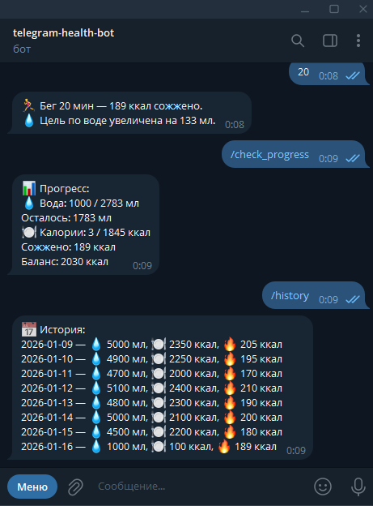

7. Графики
/plot <water/calories/burned>
- Строит график за последние 7 дней с использованием `matplotlib`

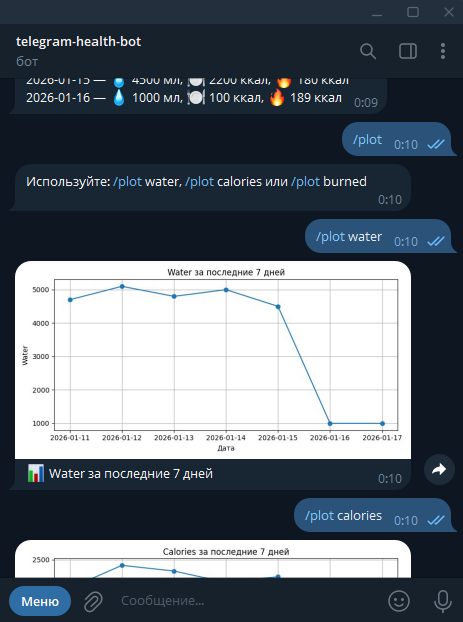

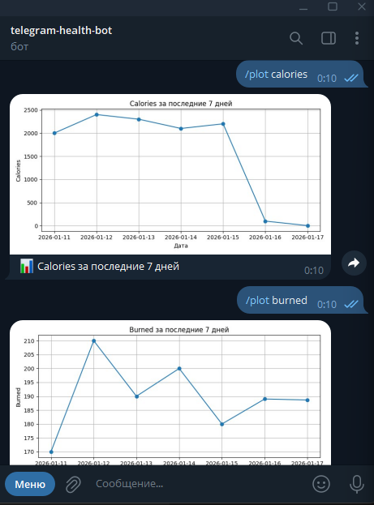

Бот был залит на YandexCloud, через severless containers

Логи:

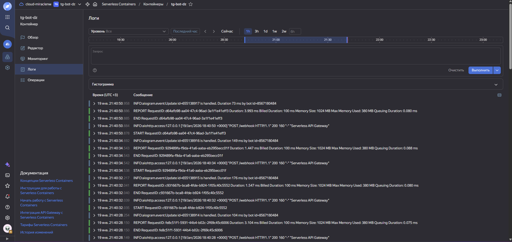

Все данные хранятся в бакетах object storage:

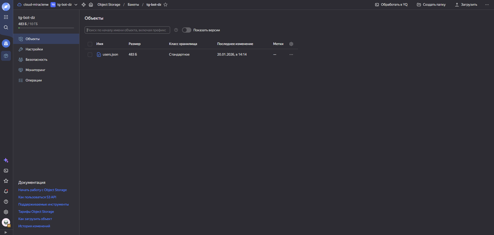

Данные пользователей хранятся в `storage.users` (JSON).

История пользователей:

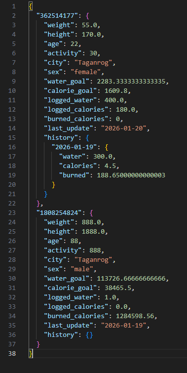
